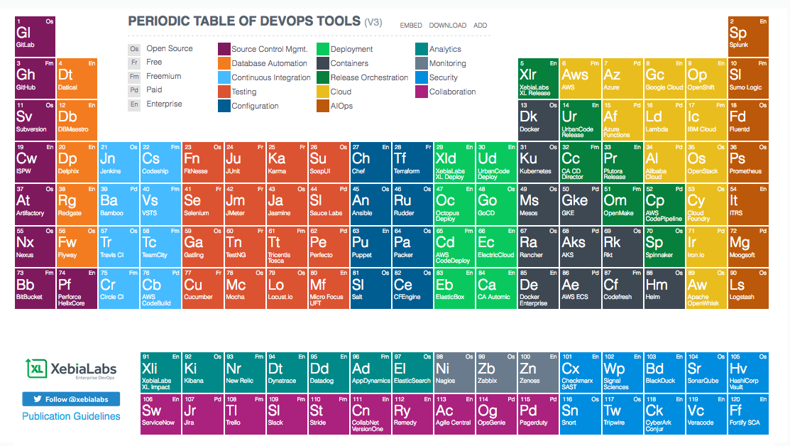

# David Hanacek

---

## Agenda

* CV Presentation:  Highlight and Achievement
* David‘s View on the DevOps Market
* Customer Case

---

## CV Presentation

You asked for PPT.
* I couldn't resist to use something else
* Let me explain
* This is very simple structured way with markup language using `#` and `*`

---
## How to get there

  * Install `git`: [Windows](https://git-scm.com/download/win) & [Mac](https://git-scm.com/download/mac)
  * Get an editor of choice
  * Stick to the relevant
  * No fancy effects

---

## Highlight

What's not in the CV

From my recent appraisal
> You have shown to be one of the most resilient, organized, methodical and consistent performers on the team. The fact that you’ve managed to get tasks and projetcs through with very positive outcomes in a context of changing priorities, and very dispersed asks, is something that sets you apart within my team. I have much appreciated having you as a very reliable team member, so which I could throw any kind of problem, knowing it would be taken care of.

---

## Achievement

Building the foundation for existing and new customers trusting my expertise continuing and expanding business together.
### Examples
* Portuguese Based customer deploying SAP HANA on cloud services
* Swiss-Spanish customer refreshing and expanding IaaS services

---

class: center, middle

# Q & A
  
---

# David‘s View on the DevOps Market

---

# Definititions & Why

* DevOps?
* Agile?
* Cloud Native?

---

#Things DevOps 'is':

* culture and operational model
* focuses on fast feedback cycles
* sustainability

---

#Things DevOps is not:

* A group
* A person
* A set of tools
* Puppet
* A workload

---

#Advantages:

* 200x faster time to market
* 2x goal achievement rate
* 60x fewer failures

---

---

Source

[https://xebialabs.com/periodic-table-of-devops-tools/](https://xebialabs.com/periodic-table-of-devops-tools/)

---

class: center, middle

# Q & A
  
---

# Customer Case

---

## Customer Case
>A customer have an heterogenous environment, Oracle DB & MW, VMware, SAP, Microsoft and you need to propose to them a migration to Cloud.

>You act as Oracle Architect and you make a presentation to the CIO and Head Applications+Infra about a possible Architecture, Roadmap, etc.

>You first start by a set the scene and describe briefly your customer. Then your start in your role as Cloud Architect. We will play the Customer role.

---

class: center, middle

# Q & A
---

class: center, middle

# Thank You!